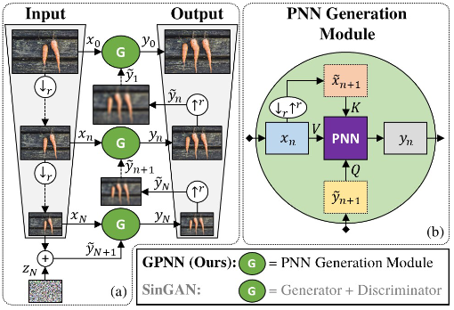
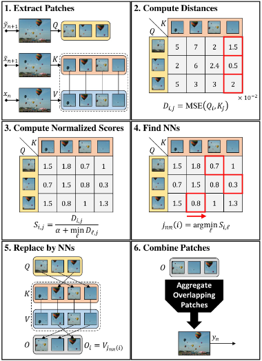
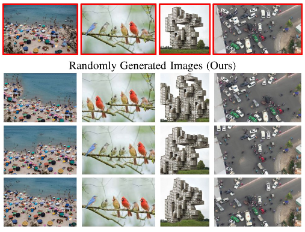
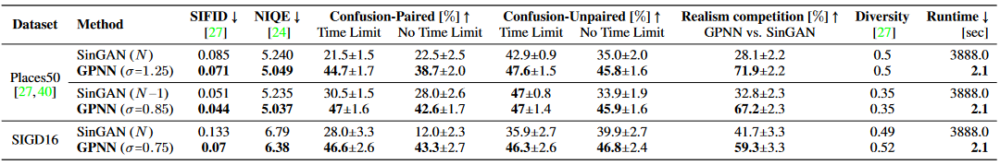

# 文献调研 —— Drop the GAN: In Defense of Patches Nearest Neighbors as Single Image Generative Models

## 论文内容

这篇论文介绍了一种新的基于块的方法——**GPNN**（Generative Patch Nearest Neighbors）。

GPNN 模仿了 SinGAN，但是放弃了其中 GAN 的部分，用了一个简单的 patch-nearest-neighbors（PNN）模块取代它，并在一些被认为只能用 GAN 解决的任务（如单图像生成）中相较于 SinGAN 取得了更快更好的结果。

### GPNN 方法

GPNN 的多级缩放结构与 SinGAN 的结构非常相似。每个缩放由一个单一的图像生成器 G 组成。生成模块 G（在 SinGAN 中是一个 GAN ），在这里被一个无参数的 PNN 生成模块取代。最粗的一级输入被注入了噪声。

#### Coarse-to-fine Strategy

下面公式是每一缩放级别进行的操作：

$$
y_{n} = G(x_{n}, \tilde{y}_{n+1})
$$

其中， $x_{n}$ 是经过 $n$ 次缩放的输入图像， $\tilde{y}_{n+1}$ 是一个初始猜测，是前 $(n+1)$ 次缩放级别的输出。

#### Patch Nearest Neighbor Generation Module

PNN 包含了以下 6 个主要算法步骤：

1. **Extract patches**：按照 Query-Key-Value 方案，从 $x_{n}$（作为 $V$）、初始猜测 $\tilde{y}_{n+1}$（作为 $Q$）和类似的模糊图像 $\tilde{x}_{n+1}$（作为 $K$）中提取完全重叠的 $p×p$ 块。唯一的例外是最粗的比例 $(n=N)$，在那里我们使用值块作为键 $(K=V)$。键和值是相匹配的（即来自同一位置的块在两个池中有相同的索引）。
2. **Compute Distances Matrix**：$D_{i,j} \leftarrow MSE(Q_{i},K_{j})$
3. **Compute Normalized Scores**：PNN 用以下相似性得分来确定视觉的完整性:
   $$
   S_{i,j} = \frac{D_{i,j}}{\alpha + min_{ℓ}D_{ℓ,j}}
   $$
   参数 $\alpha$ 是控制完整性程度的旋钮，当 $\alpha$ 较小时,可以保证完整性，而 $\alpha≫1$ 时，与使用 MSE 基本相同。
4. **Find NNs**：$j_{nn}(i) = argmin_{ℓ}S_{i,ℓ}$
5. **Replace by NNs**：每个查询块 $Q_{i}$ 被替换成其最近的邻居 $V_{j_{nn}(i)}$ 的值。输出被表示为 $Q_{i}$。
6. **Combine Patches**：重叠的块被组合成一个图像。多个重叠块中的像素使用高斯加权平均法进行汇总。

GPNN 通过在最粗的级别上注入噪声来获取多样化的输出。第四步的参数 $\alpha$ 则设定了所需的完整性水平。与基于 GAN 的方法相比，GPNN 的一个关键优势是其运行时间。基于 GAN 的方法需要一个很长的训练阶段，而 GPNN 使用一个不需要训练的无参数生成器。

### 实验结果

这篇论文对 GPNN 和 SinGAN 在基于单一自然图像的随机图像生成这一主要应用上进行了比较。实验结果如下：

从生成的图像可以看出 GPNN 的 3 个特点：

- **视觉质量**：结果看起来很清晰，几乎没有人工痕迹。
- **真实的结构**：生成的图像看起来很真实，结构有意义。
- **多样性**：GPNN 产生高多样性的结果。

接着，这篇论文对实验结果进行了定量评估。评估如下：

可以看出 GPNN 训练时间比 SinGAN 快 $10^{3}$ 倍，在无时间限制的情况下，GPNN 的得分明显好于 SinGAN（即 GPNN 生成的图像更为真实）。

### PNN vs GAN

这篇论文也对 PNN 和 GAN 进行了比较，分析了 PNN 的优势和局限性。

PNN 相比于 GAN 的优势主要来源于一个基本的区别。单图像 GAN 隐含地学习单一图像的块分布，而经典的基于块的方法则明确地保持整个块分布，并通过块最近邻搜索直接访问它。这一根本区别产生了以下优势：

- **视觉质量**：由 PNN 产生的输出图像，是由直接从输入图像中提取的原始图像块组成。相反，在 GAN 中，输出是通过一个优化过程合成的。因此，就产生了更清晰的输出，并减少了不希望出现的视觉伪影。
- **运行时间**：由于不需要进行训练，与 GAN 相比，基于块的方法的运行时间从几小时减少到几秒钟。
- **视觉完整性**：虽然 GAN 被训练成产生高相似度的块，但没有任何机制可以强制执行完整性，GAN 有遭受 mode collapse 的自然趋势。而 GPNN 第二步中的公式中的 $\alpha$ 参数则提供了一个“旋钮”来控制 GPNN 中所期望的完整性程度。
- **视觉连贯性**：PNN 防止了在输入图像中找不到的输出块的相邻性。这倾向于在输出中产生真实的外观结构。相比之下，这种一致性的趋势在 GAN 中只是被弱化了。不相关的块之间的接近可能会在生成的输出中出现，因为生成器是完全卷积的，接受领域有限。
- **控制多样性与全局结构**：在 GPNN 中添加到输入图像最粗级别的噪声的大小 $\sigma$，提供了一个“旋钮”来控制所需输出多样性的程度。而 GAN 没有任何控制保存全局结构的机制。

同时，相较于 GAN，PNN 也有以下局限性：

- **块泛化**：经典的基于块的方法使用离散的块分布。另一方面，GAN 学习一个连续的分布。因此，GAN 可以从学到的分布中产生具有高可能性的新块。这种能力在基于块的方法中是缺乏的。
- **连续输出的产生**：神经网络是连续函数。潜在输入的微小变化会导致生成的输出会出现微小的分歧。这使得潜在空间插值和其他平滑操作成为可能。而 PNN 在本质上是离散的。这阻止了在经典的基于块的方法中执行连续插值或动画。
- **映射到块与映射到像素**：最近邻查找可以最大限度地提高提取块的质量，但不能提高最终输出像素的质量。这可能会在基于块的方法中引入一些局部的模糊性。GAN 中的判别器也是以其感受野的大小来判断输出块。然而，由于生成器接收基于像素的梯度，它们可以直接对每个输出像素进行优化。

## 创新点

1. 提出了 GPNN，运用 PNN 这种旧方法解决以前被认为是“只有 GAN 可以解决”的任务。
2. 在 GPNN 中，用了一个无参数的 PNN 生成模块替代了 SinGAN 中每个缩放级别上的 GAN。
3. 与经典方法相反，在 GPNN 中，噪声被注入到最粗的级别，以引起随机性（类似于 SinGAN）。
