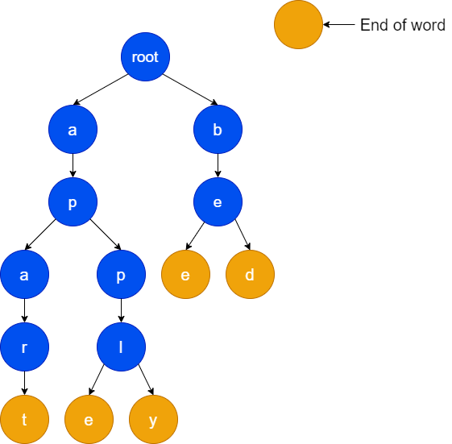

# 前缀树（Trie）详解

当我们利用搜索引擎时，只需输入部分字符，就可以得到我们想要的关键字。这种向部分键入的字符串建议可能的单词的功能便是自动补齐功能，广泛用于搜索引擎、IDE 等。那这种功能是怎样实现的呢？本文介绍的前缀树便是一种很好的解决方案。

## 基础知识

前缀树，又称字典树。它是一棵 N 叉树。前缀树一般用于存储、查找字符串。

前缀树的每个节点代表一个字符，通常用一个属性 isEnd 来标注字符串的末尾，从根节点到 isEnd 为 true 的节点的路径便是一个字符串。

前缀树的一个重要的特性是，结点所有的后代都与该结点相关的字符串有着共同的前缀，这是前缀树名称的由来。

下面这个例子，存储了 apply、apple、apart、bee 和 bed 五个单词的前缀树。



## 代码实现

下面实现用于存储、查找 26 个英文小写字母组成的字符串的前缀树。

首先，定义前缀树节点，为其分配 26 个内存分别用来存储 26 个英文小写字母，以及 isEnd 属性用来判断字符串是否在此结束。

```cpp
struct TrieNode
{
    bool isEnd;
    TrieNode *next[26];
    TrieNode()
    {
        isEnd = false;
        for (int i = 0; i < 26; i++)
        {
            next[i] = nullptr;
        }
    }
};
```

创建 Trie 类，主要有以下 3 个方法：

- `void insert(string word)`：向前缀树中插入字符串 word。
- `bool search(string word)`： 如果字符串 word 在前缀树中，返回 true（即，在检索之前已经插入）；否则，返回 false。
- `bool startsWith(string prefix)`： 如果之前已经插入的字符串 word 的前缀之一为 prefix ，返回 true ；否则，返回 false。

```cpp
class Trie
{
private:
    TrieNode *root = nullptr;

public:
    Trie()
    {
        root = new TrieNode;
    }
    ~Trie()
    {
        delete root;
        root = nullptr;
    }
    TrieNode *getRoot()
    {
        return root;
    }
    void insert(string word)
    {
        TrieNode *p = root;
        for (auto &ch : word)
        {
            if (p->next[ch - 'a'] == nullptr)
            {
                p->next[ch - 'a'] = new TrieNode();
            }
            p = p->next[ch - 'a'];
        }
        p->isEnd = true;
    }
    bool search(string word)
    {
        TrieNode *p = root;
        for (auto &ch : word)
        {
            if (p->next[ch - 'a'] == nullptr)
            {
                return false;
            }
            p = p->next[ch - 'a'];
        }
        return p->isEnd;
    }

    bool startsWith(string prefix)
    {
        TrieNode *p = root;
        for (auto &ch : prefix)
        {
            if (p->next[ch - 'a'] == nullptr)
            {
                return false;
            }
            p = p->next[ch - 'a'];
        }
        return true;
    }
};
```

插入或搜查询字符串的时间复杂度均为 O(L)，其中 L 是字符串的长度。
