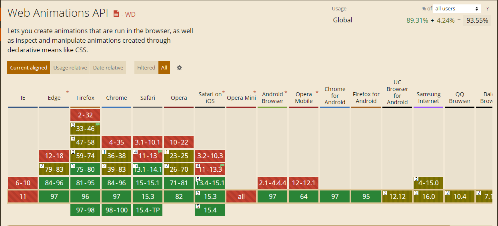

# Web Animations API：新兴的浏览器动画解决方案

WAAPI（Web Animations API）是用于浏览器动画的原生 API。相比于前端的的动画解决方案（CSS 动画、requestAnimationFrame），WAAPI 可以更好地和 JavaScript 配合使用，在功能方面也更加丰富。[MDN](https://developer.mozilla.org/en-US/docs/Web/API/Web_Animations_API) 上丰富的文档，本文也将介绍和讲解 WAAPI。

## 浏览器支持
首先，我们可以通过 [caniuse](https://caniuse.com/) 查看一下 WAAPI 的浏览器支持。



虽然在部分浏览器支持有限，但 WAAPI 有全面且强大的 [polyfill](https://github.com/web-animations/web-animations-js) ，在生产模式下，依然可以使用 WAAPI。

## 举个例子

一个简单的平移动画：

```javascript
const box1 = document.querySelector('#box1')
const keyframes = {
  transform: ['translateX(100px)'],
}
const options = {
  iterations: Infinity,
  duration: 2000,
  fill: 'both',
  easing: 'linear',
}
const kyEffect = new KeyframeEffect(box1, keyframes, options)
const player = new Animation(kyEffect)
player.play()

```


## KeyFrameEffect 对象

KeyFrameEffect 对象是描述节点执行什么样的动画效果，其构造函数一般有三个参数：target，keyframe 和 option。

### target
动画绑定的节点。

### keyframes
关键帧格式的对象。

### options
动画持续时间或一个对象。
```typescript
type cubicBezier<T extends string> = `cubic-bezier${T}`
type options = {
  delay?: number //延迟动画开始的毫秒数
  direction?: 'normal' | 'reverse' | 'alternate' | 'alternate-reverse' //动画执行的方向
  iterations?: number //动画的重复次数
  duration?: number //动画每次迭代完成所需的毫秒数
  fill?: 'both' | 'backwards' | 'forwards' | 'none' //动画执行前后的状态
  easing?: 'linear' | 'ease' | 'ease-in' | 'ease-out' | 'ease-in-out' | cubicBezier<string> //动画随时间变化的速率
  endDelay?: number //动画结束后延迟的毫秒数
  iterationStart?: number //描述动画应该在迭代中的哪个点开始
  composite?: 'add' | 'accumulate' | 'replace' //确定如何在此动画和其他未指定其特定复合操作的单独动画之间组合值
  iterationComposite?: 'accumulate' | 'replace' //确定在此动画中如何从迭代到迭代构建值。
}

```

## Animation 对象

Animation 对象控制着动画的播放和停止。Animation 对象的部分属性如 finished 返回一个 Promise 对象，很好的支持了异步操作。Animation 对象的方法可以轻易地控制动画的开始和结束。

一个很实用的场景：

当第一个动画结束后执行第二个动画。

```javascript
const box1 = document.querySelector('#box1')
const box2 = document.querySelector('#box2')
const keyframes = {
  transform: ['translateX(100px)'],
}
const options = {
  iterations: 1,
  duration: 2000,
  easing: 'linear',
}
const kyEffect1 = new KeyframeEffect(box1, keyframes, options)
const kyEffect2 = new KeyframeEffect(box2, keyframes, options)
const player1 = new Animation(kyEffect1)
const player2 = new Animation(kyEffect2)
const myPlay = async ()=> {
  player1.play()
  await player1.finished
  player2.play()
}
myPlay()

```


## Element.getAnimations() 方法

这个方法用于节点中所有动画，返回一个由 Animation 对象组成数组。

下面的代码将页面上的所有动画的速度减半。

```javascript
document.getAnimations().forEach( (animation) => {
  animation.playbackRate *= 0.5
})
```

## Element.animate() 方法

这个方法可以便捷的创建动画，返回一个 Animation 对象，并自动执行 Animation 对象的 play() 方法。

下面的代码创建并播放动画，使其无限向上平移。

```javascript
document.getElementById('box').animate(
  [
    // keyframes
    { transform: 'translateY(0px)' },
    { transform: 'translateY(-300px)' },
  ],
  {
    // timing options
    duration: 1000,
    iterations: Infinity,
  },
)
```

## 更多例子

[利用 WAAPI 实现百叶窗切页效果](https://blog.csdn.net/hulala1a/article/details/122848552)

